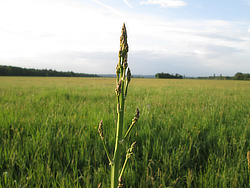

# spargel

> THE blog engine nobody asked for!



(Img: https://commons.wikimedia.org/wiki/Category:Asparagus_officinalis#/media/File:20180428Asparagus_officinalis1.jpg)

## Features

- Post display
- Pagination
- Feed (RSS)
- Simple categories
- Robots.txt generation on the fly (in case you need to hide some posts from Crawlers)
- Markdown support
- KI based* image preview


---
*or maybe just "if"..who knows

## Requirements

- Build with `rustc 1.77.0-nightly` or later.
- Build with `cargo build`

## Post Syntax

> Everything is a post. Also pages. Except when not.


**The HTML comments are only added for documentary purposes**

```
Title (will be sluggified)
Date (Y-m-d H:M)
:post,:hide,:anycategory,:commaseparatedbutprefixed
Your text, can be **Markdown**.
<!-- Add a newline at the end -->
## License

AGPLv3